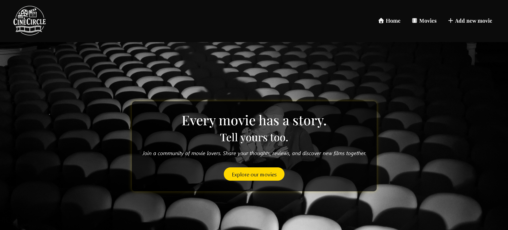
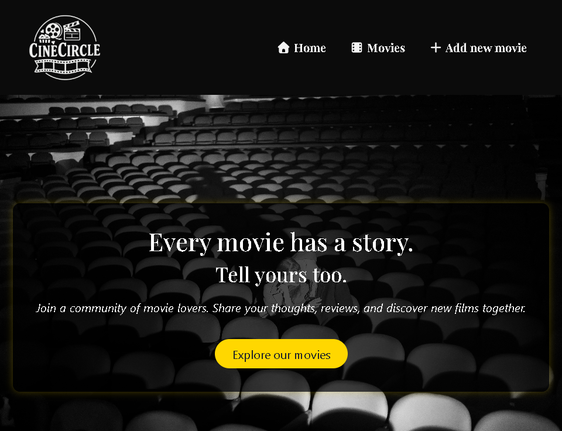
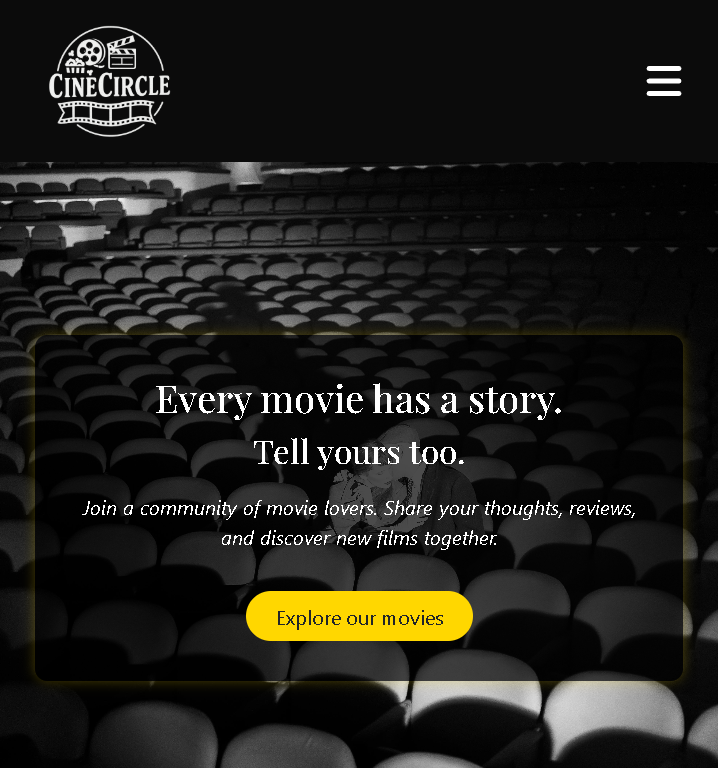

# 🎬 Cine Circle – Frontend (`webapp-react`)
> Frontend del progetto Cine Circle, un blog di cinema in stile retrò.
     
Questa repository contiene la parte **client-side** dell’applicazione, sviluppata con **React**, che consuma le API REST del backend (`webapp-express`) per visualizzare film, dettagli e recensioni.

---

## 🧩 Stack Tecnologico

- **React.js** → struttura a componenti
- **React Router DOM** → gestione del routing
- **Axios** → comunicazione con il backend
- **Bootstrap / CSS** → interfaccia e layout responsive
- **Vite** → build tool e server di sviluppo
- **dotenv** → gestione variabili d’ambiente

---

## 🏗️ Struttura del Progetto

```bash
webapp-react/
│
├── components/              # Componenti riutilizzabili (card, form, navbar, ecc.)
├── contexts/                # Gestione dello stato globale con Context API
├── layouts/                 # Layout principale con Header e Footer
├── pages/                   # Pagine principali (Home, Movies, Details, Add)
├── src/
│   ├── assets/              # Immagini e risorse statiche
│   ├── App.jsx              # Definizione rotte principali
│   ├── index.css            # Stili globali
│   └── main.jsx             # Inizializzazione app
│
├── index.html               # Entry point Vite
├── package.json
└── README.md

```

## ⚙️ Setup del progetto

1️⃣ Clona la repository
```bash
git clone https://github.com/giorgiameffe/webapp-react.git
cd webapp-react
```

2️⃣ Installa le dipendenze
```bash
npm install
```

3️⃣ Avvia il server di sviluppo
```bash
npm run dev
```

L’applicazione sarà disponibile su [`http://localhost:5173`](http://localhost:5173).

💡 Assicurati che il backend (webapp-express) sia in esecuzione prima di accedere alle pagine che richiedono dati (es. Movies o Details).

---

## 🔗 Rotte principali

| Percorso        | Pagina               | Descrizione                                  |
| --------------- | ------------------------- | -------------------------------------------- |
| `/`             | `Homepage`                | Pagina iniziale con introduzione al progetto |
| `/movies`       | `Movies`              | Elenco dei film con ricerca e filtri         |
| `/movies/:slug` | `MovieDetails`        | Dettagli di un singolo film e recensioni     |
| `/movies/new`   | `AddMoviePage`            | Form per aggiungere un nuovo film            |
| `*`             | `NotFoundPage` | Pagina non trovata                 |

---

## 📸 Screenshot

### 💻 Modalità Desktop



### 📱 Modalità Tablet



### 📞 Modalità Mobile



📷 Le immagini mostrano la piena responsività del layout, progettato per adattarsi in modo fluido a diverse dimensioni di schermo.

---

## 🧠 Funzionalità principali

- Visualizzazione film e recensioni tramite API REST
- Ricerca film per titolo, regista o descrizione
- Aggiunta di nuovi film (con upload immagine gestito dal backend)
- Creazione di recensioni per ciascun film
- Layout responsive ottimizzato per desktop, tablet e mobile
- Gestione globale dello stato “loading” con Context API
- Gestione errori e pagine 404 personalizzate

---

## 🧰 Script disponibili

| Comando           | Descrizione                           |
| ----------------- | ------------------------------------- |
| `npm run dev`     | Avvia l’ambiente di sviluppo con Vite |
| `npm run build`   | Compila il progetto per la produzione |
| `npm run preview` | Avvia un’anteprima locale della build |

---

## 🔗 Backend collegato

Questo progetto comunica con il backend Express, disponibile qui:
👉 [Cine Circle Backend](https://github.com/giorgiameffe/webapp-express).

---

## 👩‍💻 Autore
**Giorgia Meffe**  
Progetto personale realizzato con React.